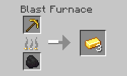
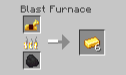
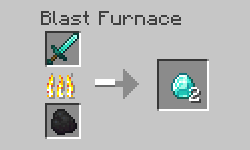
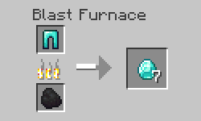
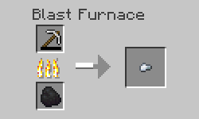
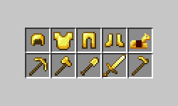
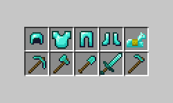
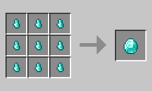
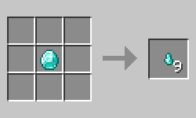
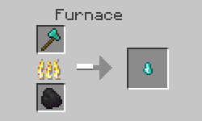

# Recycler

## Minecraft mod that allows you to recycle your damaged tools and armor in the blast furnace.

---

### This mod allows you do melt down tools and armor back to materials in the blast funace.






---

### The amount of materials you get back depends on durability.




---

### All these items can be recycled in the blast furnace by default.





---

### A diamond nugget is added so that you can melt down damaged diamond equipment.




---

### Be careful! If you melt your equipment in the regular furnace you still get only a nugget back.



---

### More recipes can be added via data packs.

Sample recipe json:

```json
{
  "type": "recycler:blasting_recycling",
  "ingredient": {
    "item": "minecraft:iron_pickaxe"
  },
  "results": [
    "minecraft:iron_ingot",
    {
      "item": "minecraft:iron_nugget",
      "count": 9
    }
  ],
  "max_output": 3
}

```

`max_output` is the amount you get back when the item is not damaged at all.

The item from `results` that has the lowest `count` will be tried first and if `max_output × count × durability_percentage` is less than `1` the item with the next lowest `count` will be tried.
